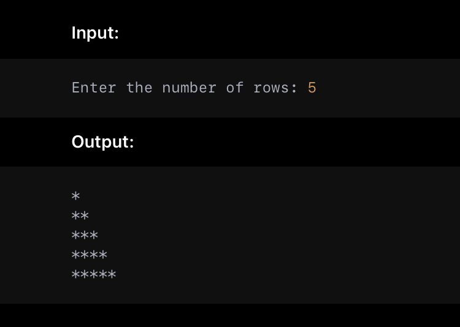

<h1>30 days coding challenge</h1>
<br/>
<h2>Day 1 python problem:</h2> 
<br/>
<h3>Write a Python program that takes the number of rows as input and prints the following star pattern.</h3>

<hr/>
<h2>Day 2 python problem</h2>
<br/>
<h3>Write a program that takes a list of numbers as input and separates the odd and even numbers into two different lists. Print both lists as well.</h3>
```
python
#input 
[1,2,3,4,5,6,7,8,9,10]
#output
odd : [1,3,5,7,9]
even : [2,4,6,8,10]

